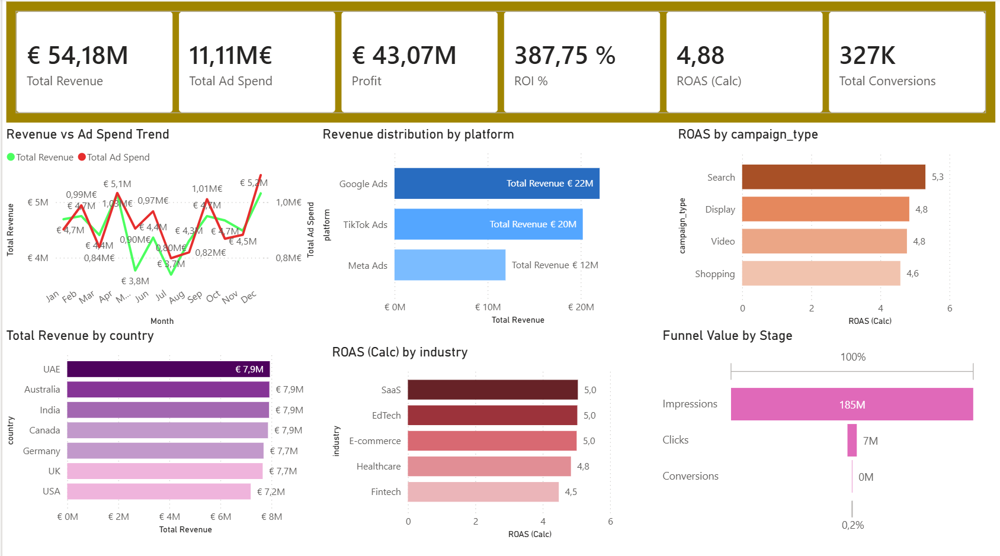

#  Marketing Performance & ROI Dashboard (Power BI)

## 📂 Dataset Overview

The dataset contains marketing campaign performance data across multiple platforms, countries, and industries. It is used to analyze both **revenue generation** and **marketing efficiency**.

### 📊 Data Structure

Each row represents a campaign performance record with the following key attributes:

- **date** – Campaign date (time-based analysis)
- **platform** – Marketing platform (Google Ads, TikTok Ads, Meta Ads)
- **campaign_type** – Type of campaign (Search, Display, Video, Shopping)
- **industry** – Industry category (SaaS, EdTech, E-commerce, Healthcare, Fintech)
- **country** – Target country of the campaign

---

### 📈 Performance Metrics

- **impressions** – Number of times ads were shown  
- **clicks** – Number of user clicks  
- **conversions** – Number of successful actions (e.g., purchases, sign-ups)  

---

### 💰 Cost & Revenue Metrics

- **ad_spend** – Total advertising cost  
- **revenue** – Revenue generated from campaigns  

---

### 📊 Pre-Calculated Metrics (in dataset)

- **CTR** – Click-through rate  
- **CPC** – Cost per click  
- **CPA** – Cost per acquisition  
- **ROAS** – Return on ad spend  

---

##  Project Overview

This project focuses on analyzing marketing campaign performance using Power BI, with the goal of answering a simple but practical question:

**Are marketing campaigns actually profitable, and where should budget be optimized?**

Instead of just visualizing data, this dashboard is designed to support **decision-making** across platforms, campaign types, countries, and industries.

---

## Key Business Questions

This dashboard was built to answer:

- Which platform generates the highest revenue?
- Which campaigns are efficient (high ROAS, low CPA)?
- Are we investing in the right countries and industries?
- Where are we losing users in the funnel (Impressions → Clicks → Conversions)?
- Which areas should be optimized or scaled?

---
## 📸 Dashboard Preview

### 🔹 Full Dashboard

## 🎥 Dashboard Demo

A quick preview of the interactive dashboard:

👉 Full video walkthrough:  
[text](https://www.linkedin.com/posts/govindashaw74_powerbi-dataanalytics-learninginpublic-ugcPost-7453124297839079424-y7uk?utm_source=share&utm_medium=member_desktop&rcm=ACoAACK15uYBfNQsnyrCn1IB3jpylKgSb5cYaMM)
---

## Dashboard Features

### 1. Executive Overview
- Total Revenue, Ad Spend, Profit
- ROI % and ROAS
- Total conversion

 **Overall campaigns are profitable, with revenue significantly exceeding ad spend.
   The key opportunity lies in improving conversion efficiency rather than increasing spend.**

---

### 2. Revenue vs Ad Spend Trend

- This section compares monthly revenue with advertising spend to evaluate overall marketing efficiency over time.

**Key observations:**

- Revenue generally follows the trend of ad spend, indicating a strong relationship between investment and returns  
- Peak performance is observed in **April and December**, where both revenue and spend are highest  
- A noticeable drop occurs around **May–July**, suggesting seasonal impact or reduced campaign effectiveness  
- Despite fluctuations in spend, revenue remains relatively stable, indicating consistent baseline performance  

**Insight:**

While increasing ad spend contributes to higher revenue, the variation across months suggests that **timing and campaign effectiveness play a crucial role**, not just budget allocation.

---

### 3. Platform Performance

This section compares revenue contribution and efficiency across different marketing platforms.

**Key observations:**

- **Google Ads** generates the highest revenue (~€22M), making it the primary revenue driver  
- **TikTok Ads** delivers the **highest efficiency**, with strong ROAS (~7.6) and the lowest CPA (~21.7)  
- **Meta Ads** performs moderately, with balanced revenue and efficiency but not leading in either  

**Insight:**

While Google Ads is the main contributor to total revenue, **TikTok Ads stands out as the most efficient platform**, delivering higher returns at a lower cost.  

This suggests that increasing investment in TikTok Ads could improve overall profitability, while Google Ads should be maintained for scale. Meta Ads may require optimization or strategic adjustment.

---

### 4. Campaign Type Analysis
This section evaluates the effectiveness of different campaign types using ROAS and CPA.

**Key observations:**

- **Search campaigns** deliver the highest efficiency, with the strongest ROAS (~5.3) and relatively low CPA  
- **Display and Video campaigns** show consistent but slightly lower performance (~4.8 ROAS)  
- **Shopping campaigns** have the lowest ROAS (~4.6) and comparatively higher CPA  

**Insight:**

Search campaigns are the most effective in converting spend into revenue, making them a strong candidate for scaling.  

Display and Video campaigns provide stable performance and can support awareness and engagement strategies.  

Shopping campaigns may require optimization, as they deliver lower returns relative to cost.

---

### 5. Country & Industry Insights
#### Revenue distribution across countries

This section analyzes revenue distribution across different countries.

**Key observations:**

- Revenue is relatively evenly distributed across most countries, with several markets (UAE, Australia, India, Canada) generating similar results (~€7.9M)  
- Germany and the UK show slightly lower but still strong performance  
- The USA contributes the lowest revenue among the selected markets  

**Insight:**

The relatively balanced distribution suggests that marketing efforts are performing consistently across regions.  

Rather than focusing on a single dominant market, this indicates an opportunity to **optimize performance within each country** rather than reallocating budget heavily between regions.

--- 

#### Industry-level performance (ROAS)

This section compares marketing efficiency across different industries using ROAS.

**Key observations:**

- **SaaS, EdTech, and E-commerce** show the highest performance, with ROAS values around ~5.0  
- **Healthcare** performs slightly lower but remains relatively strong (~4.8)  
- **Fintech** has the lowest ROAS (~4.5), indicating comparatively lower efficiency  

**Insight:**

Marketing campaigns appear to be more effective in SaaS, EdTech, and E-commerce industries, where higher returns are generated for each unit of ad spend.  

Fintech, on the other hand, may require optimization in targeting or campaign strategy to improve efficiency.

---

### Country * Industry Analysis

A matrix view was used to analyze how different industries perform across countries.

**Key observations:**

- Revenue distribution across industries is relatively balanced within each country  
- No single industry dominates across all regions  
- Some countries show slightly stronger performance in specific industries, but differences remain moderate  

**Insight:**

The results suggest that marketing performance is fairly consistent across industries and regions, indicating a stable and diversified strategy.  

Rather than focusing on a single market or industry, there is an opportunity to **optimize performance within each country–industry combination** for better efficiency.

---

### 6. Funnel Analysis

### 🔻 Funnel Analysis (Impressions → Clicks → Conversions)

This section analyzes the user journey from ad exposure to final conversion.

**Key observations:**

- A very large volume of impressions (~185M) generates relatively fewer clicks (~7M), resulting in a low click-through rate (~3.85%)  
- A further drop occurs from clicks to conversions (~326K), with a conversion rate of ~4.6%  
- The most significant drop-off happens at the **impression to click stage**  

**Insight:**

The primary bottleneck in the funnel is user engagement at the initial stage. While campaigns are reaching a wide audience, they are not effectively converting impressions into clicks.  

However, once users click, the conversion rate is relatively stronger, indicating that the landing experience or offer is reasonably effective.

This suggests that optimizing **ad creatives, targeting, and messaging** could significantly improve overall performance.

---

## 🛠 Tools & Technologies

- **Power BI**
  - Data modeling and transformation
  - Interactive dashboard design
  - Data visualization

- **DAX (Data Analysis Expressions)**
  - Custom KPI calculations (ROAS, CPA, ROI, Conversion Rate)
  - Measures and calculated columns

- **Data Preparation**
  - Data cleaning and structuring within Power BI

- **Business Analysis Concepts**
  - Funnel analysis (Impressions → Clicks → Conversions)
  - Marketing performance metrics
  - ROI and efficiency analysis

---

## 📂 Dataset

The dataset contains marketing campaign data including:

- Platform, campaign type, industry, country
- Impressions, clicks, conversions
- Ad spend, revenue
- Pre-calculated metrics (CTR, CPC, CPA, ROAS)

---

## Key Metrics (DAX)

Some KPIs were recalculated using DAX for accuracy:

- ROAS = Revenue / Ad Spend
- CPA = Ad Spend / Conversions
- ROI = (Revenue - Ad Spend) / Ad Spend
- Conversion Rate = Conversions / Clicks

---

## 📈 What I Learned

- Building dashboards is not just about visuals, but about **answering business questions**
- KPI design (ROAS, CPA, ROI) is critical for meaningful insights
- Structuring a dashboard for clarity improves usability significantly
- Data storytelling is as important as technical implementation

---

## 🚀 Future Improvements

- **Time-Based Analysis & Forecasting**
  - Extend the dataset to multiple years
  - Apply trend analysis and forecasting for future performance

- **A/B Testing Insights**
  - Compare campaign variations to identify best-performing creatives or strategies

- **Integration with Real-Time Data**
  - Connect to live marketing APIs (e.g., Google Ads, Meta Ads)
  - Enable real-time performance monitoring
---

## 🤝 Connect with Me

If you have feedback or suggestions, I’d be happy to hear them.

🔗 LinkedIn: www.linkedin.com/in/govindashaw74  
---
